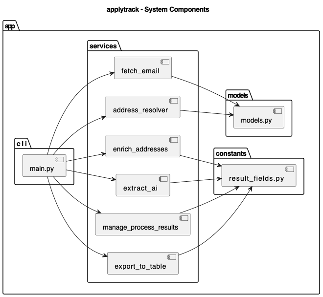
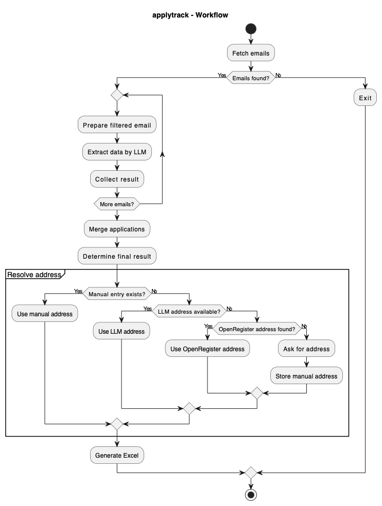
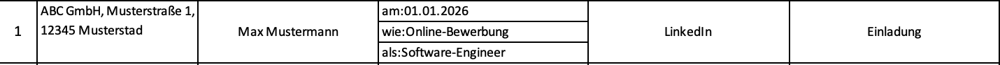

> German Version: [README.de.md](README.de.md)

# applytrack

Automated email tracking for job applications via IMAP with local LLM extraction and Excel export for structured documentation of application activities.

---

## Project Goal

applytrack supports the automated tracking of application processes by:

- Fetching application emails via IMAP
- Local extraction of relevant information using an LLM
- Merging related applications (Deduplication + Merge)
- Completing missing address data through defined fallbacks
- Exporting into a predefined Excel template for documentation purposes

---

## What Problem Is Solved with using AI?

Application emails are highly inconsistent in:

- Structure
- Language
- Wording
- Signatures and contact persons

Regex-based evaluation is therefore:

- complex
- error-prone
- difficult to maintain

applytrack uses a local LLM instead for semantic extraction.

Advantages:

- more robust content recognition
- fewer edge cases
- better maintainability

---

## Architecture Design

See figure **applytrack – System Components**  

---

## Workflow / Business Logic

See figure **applytrack – Workflow**  

---

## Demo Output

Example of a generated Excel output (fictional data):

---

## Technologies Used

- **Python 3**
- **IMAPClient** - Fetching emails via IMAP (SSL)
- **html2text** - Converting HTML emails into plain text
- **Ollama (local)** - Running a local LLM (model: phi4)
- **OpenAI Python Client** - Using the Ollama API via an OpenAI-compatible interface
- **sqlite3** - Storage of manual and external address data
- **openpyxl** - Export into an Excel template

---

## Privacy Notice

This project is intended exclusively for private use.

It processes application emails locally on the user’s device.  
Personal data may be included:

- Company names
- Contact persons
- Job titles
- Dates
- Application status (rejection, invitation, intermediate status)

Processing is:

- fully local
- user-initiated
- without cloud transmission

The user is solely responsible for lawful use and compliance with applicable data protection regulations.

This project does not constitute legal advice.

---

## Address Data (optional)

To complete missing addresses, a local SQLite database with open register data can be used  
(OffeneRegister.de or OpenCorporates, license: CC BY 4.0).

Responsibility for attribution and license compliance lies with the user.

---

## Intended Scope of Use

- Private application management
- Documentation of personal application activities
- Evidence for official reporting obligations

---

## Not Intended Use

- Access to third-party mailboxes
- Large-scale data collection
- Commercial use or SaaS operation
- Profiling or automated evaluation of individuals

---

## Disclaimer

This project is provided without warranty.  
The author assumes no liability for misuse or unlawful use.

---